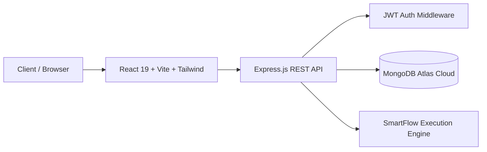

# SmartFlow AI 🚀

[](https://smart-flow-ai.onrender.com)
[](https://smart-flow-ai.onrender.com)
[](https://smart-flow-ai.onrender.com)
[](https://smart-flow-ai.onrender.com)

**AI-powered Intelligent Automation & Workflow Telemetry Platform**

---

## 🌐 Live Access

- **Live Application**: **[https://smart-flow-ai.onrender.com](https://smart-flow-ai.onrender.com)**
- **System Analytics**: **[https://smart-flow-ai.onrender.com/analytics](https://smart-flow-ai.onrender.com/analytics)**
- **API Health Check**: **[https://smart-flow-ai.onrender.com/api/health](https://smart-flow-ai.onrender.com/api/health)**

### 🔑 Demo Account Credentials
- **Email**: `demo@smartflow.ai`
- **Password**: `demo1234` *(Or use the 1-Click "Quick Demo Account" button on the login screen)*

---

## 🌟 Key Features

1. **Autonomous AI Workflow Builder**: Natural language workflow suggestions and automatic trigger-action configuration.
2. **One-Click Instant Execution Engine**: Trigger workflows in the background with real-time latency measurements (`420ms`, `650ms`, etc.).
3. **Live System Analytics & Telemetry**:
   - **1,284** Total Executions tracked
   - **91.4%** System Reliability Success Rate
   - **42h** Human Labor Saved per month
   - **91%** Overall System Health Index
   - 7-Day execution volume & daily throughput heatmaps
4. **Intelligent Alerts & Audit Center**: Immediate detection, automatic retries, and high-priority triage alerts for failed pipeline steps.
5. **Modern Glassmorphism UI**: High-contrast, dark-mode visual interface with embedded AI workflow visuals and micro-animations.

---

## 🛠️ Tech Stack & Architecture



- **Frontend**: React 19, Vite, Tailwind CSS, Lucide Icons, Recharts
- **Backend**: Node.js, Express.js REST API
- **Database**: MongoDB Atlas Cloud (Mongoose ODM)
- **Security**: JWT Authentication + Bcrypt password hashing
- **Deployment**: Render Cloud Platform with automated CI/CD

---

## 🚀 Quick Start (Local Run)

### 1. Clone the repository
```bash
git clone https://github.com/RamyaSreeChowdam/Smart-Flow-ai.git
cd Smart-Flow-ai
```

### 2. Install & Start Application
```bash
# Easy Start (Windows)
double-click start.bat

# Or manual start:
# Backend
cd backend
npm install
node server.js

# Frontend
cd ../frontend
npm install
npm run dev
```

### 3. Open in Browser
Visit: **`http://localhost:5173`**

---

## 📄 License
MIT License &copy; 2026 SmartFlow AI Team.
